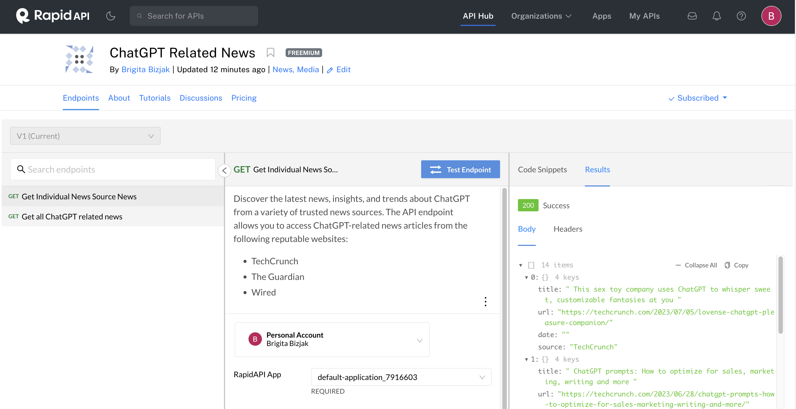

# ChatGPT News API

Welcome to the ChatGPT News API! This API allows you to extract ChatGPT related news from a variety of trusted news sources. Simply provide the specific newspaper ID to retrieve news articles published by that particular company. Available trusted news sources are: 
- TechCrunch
- The Guardian
- Wired
- The Verge
- The New York Times
- The Economist
- MIT Technology Review
- Indian Express
- BATimes
- Vox
- Suddeutsche Zeitung
- Le Figaro

This project has been inspired by Ania's YouTube tutorial: [Build and sell your own API](https://www.youtube.com/watch?v=GK4Pl-GmPHk&t=2). 

## Technologies Used

- JavaScript
- Node.js
- Express.js
- Heroku
- Rapid API

### Demo 



See also ChatGPT Related News on Rapid API [here](https://rapidapi.com/brigitabizjak05/api/chatgpt-related-news/).
## Installation

1. Clone the repository:
   ```bash
   git clone <git@github.com:brigitabi/Building-my-own-API.git>
